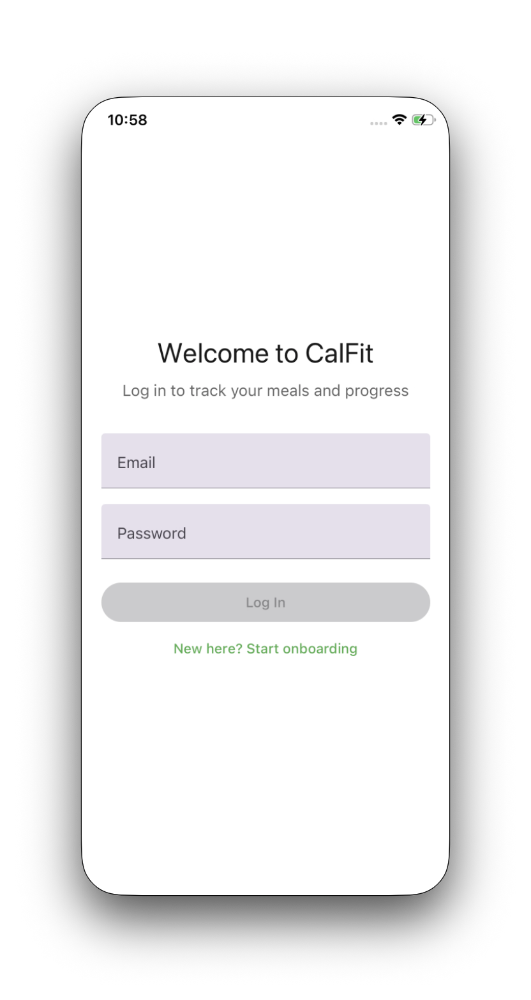
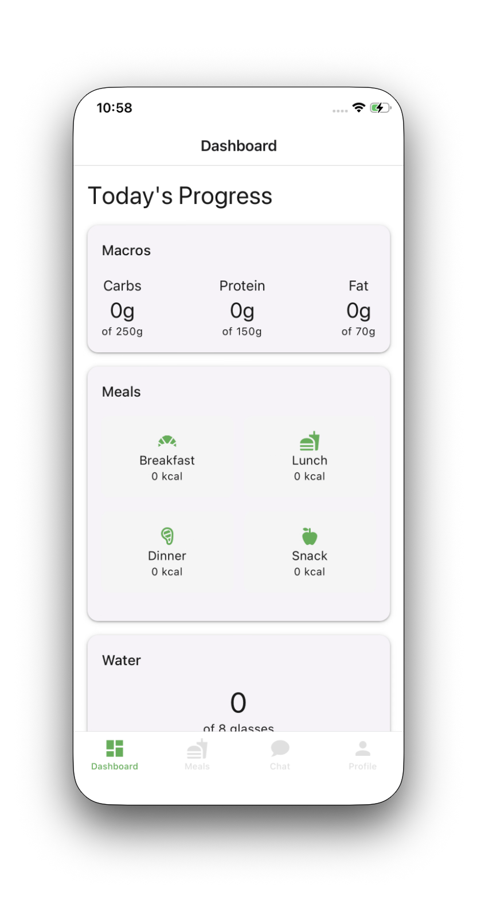
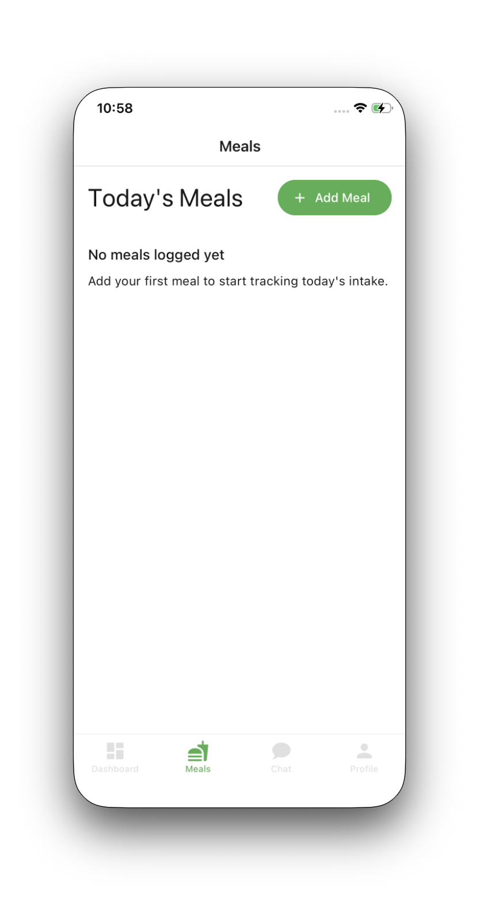
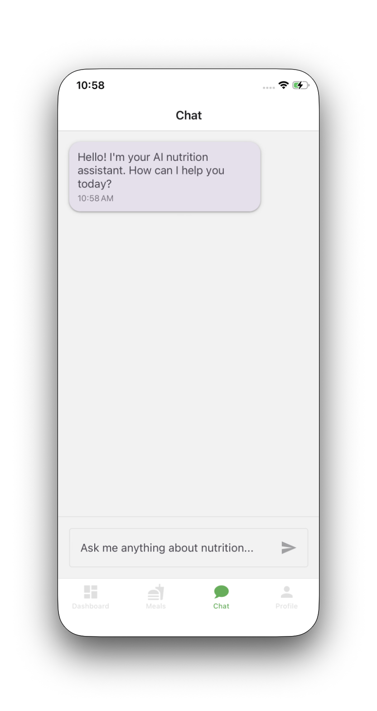
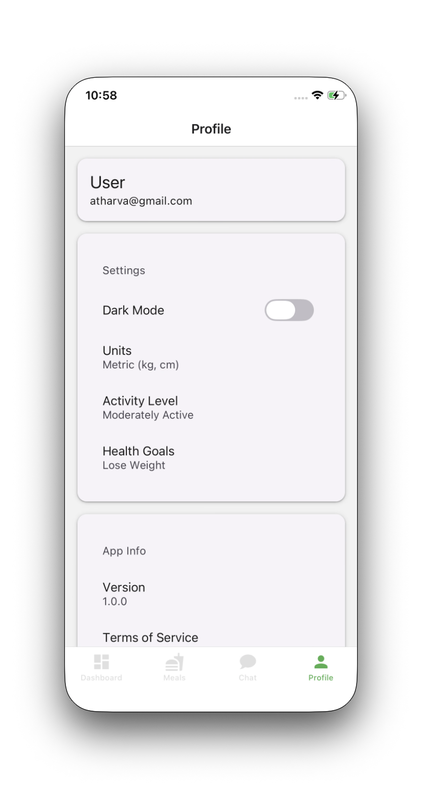

# CalFit

AI-powered calorie tracking and nutrition monitoring for iOS and Android.

---

## Download

### Android APK
Install the latest preview build directly on your Android device:

[Download CalFit APK](https://expo.dev/accounts/atharvapatil/projects/calfit/builds/e7cd4b98-7ddd-4a6e-b1d6-9d42ff7097d3)

---
##  Version History

### v1.0.0 (Beta)
- Initial release with core features

### v1.1.0 (Stable)
- Fixed auth/session issues
- Stable meal logging
- Reliable food search
- AI chat integration
- Full dark mode support

## Features

| Feature | Description |
|---------|-------------|
| **AI Assistant** | Chat with an AI nutritionist for personalized meal suggestions |
| **Meal Logging** | Log meals and track macros (protein, carbs, fats, fiber) |
| **Calorie Tracking** | Visual progress toward daily calorie and protein goals |
| **User Profile** | Customize health goals, activity level, and dietary preferences |
| **Cloud Sync** | Meal data synced across devices via Supabase |
| **Authentication** | Secure email/password login with Supabase Auth |

---

## Screenshots

| | | |
|---|---|---|
|  |  |  |
| Dashboard | Meals | Add Meal |
|  |  | |
| AI Chat | Profile | |

---

## Tech Stack

| Category | Technology |
|----------|------------|
| Framework | React Native + Expo SDK 54 |
| Routing | Expo Router |
| Language | TypeScript |
| UI Components | React Native Paper (Material Design 3) |
| Backend | Supabase (PostgreSQL + Auth) |
| AI | DeepSeek (via OpenRouter API) |
| Build | EAS Build (New Architecture enabled) |

---

## Project Structure

```
calfit/
├── app/                    # Expo Router pages
│   ├── (auth)/           # Authentication flows
│   │   ├── login.tsx
│   │   ├── register.tsx
│   │   └── ...
│   ├── (tabs)/           # Main app tabs
│   │   ├── dashboard.tsx
│   │   ├── meals.tsx
│   │   ├── chat.tsx
│   │   └── profile.tsx
│   └── _layout.tsx       # Root layout
├── src/
│   ├── components/        # Reusable UI components
│   ├── constants/         # Theme and app constants
│   ├── context/           # React context providers
│   ├── lib/               # Third-party client setup
│   ├── services/          # API integration layer
│   └── types/             # TypeScript type definitions
├── assets/                 # Icons and images
└── android/               # Native Android project
```

---

## Local Development

### Prerequisites

- Node.js 18+
- npm 9+ or yarn
- Expo CLI (`npx expo`)
- Android Studio (for Android emulator)
- Xcode (for iOS simulator, macOS only)

### Setup

```bash
# Clone the repository
git clone https://github.com/atharvapatil/CalFit.git
cd CalFit

# Install dependencies
npm install

# Start development server
npm start
```

### Environment Variables

Create a `.env` file in the root directory:

```env
EXPO_PUBLIC_SUPABASE_URL=https://your-project.supabase.co
EXPO_PUBLIC_SUPABASE_ANON_KEY=your-anon-key
EAS_PROJECT_ID=your-eas-project-id
```

### Running the App

```bash
npm start          # Start Metro bundler

# In another terminal:
npm run android   # Run on Android emulator/device
npm run ios        # Run on iOS simulator (macOS only)
```

---

## Building

### Android APK (EAS)

```bash
# Preview build (APK)
eas build --platform android --profile preview

# Production build (AAB)
eas build --platform android --profile production
```

### Requirements


- [EAS CLI](https://docs.expo.dev/build/eas-json/): `npm install -g eas-cli`
- EAS account linked to your Expo project

---

## License

MIT License - see [LICENSE](LICENSE) for details.
